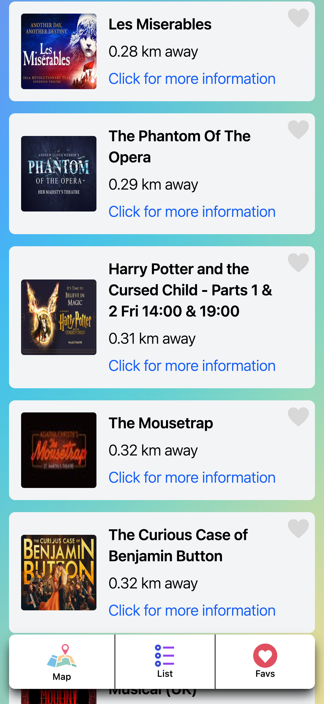
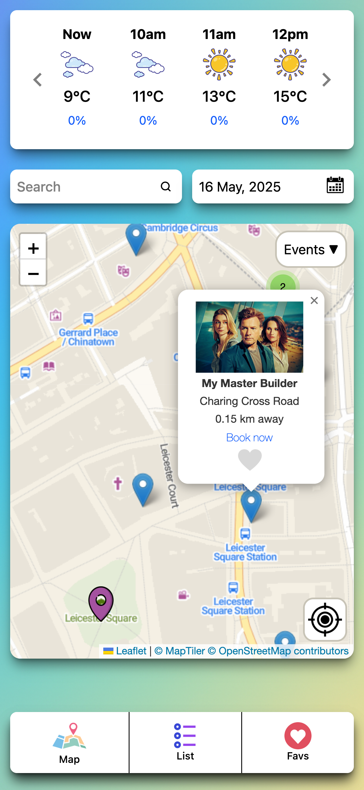

# Hello, I'm Tyler 👋

## About me 🤔
I have an infatuation for computers & technical subjects. I love to learn & work through challenges. Working under pressure is my forte. Whether working independently or as part of a team, I bring a positive and collected mindset to the table.
Dark-mode proponent. Objectively, the best color is blue.

## My Stack 📚

## What I'm working on 💻

### PinPoint

PinPoint is a real-time travel companion. Adventure on demand, wherever you land.
• Displays up to 400 local events, activities & restaurants within a 5-mile radius to users.
• Broadcasts a 24-hour weather forecast using the OpenMeteo API for satisfactory planning.
It has been built to be simple, efficient, and most of all: useful.

#### Teck Stack

