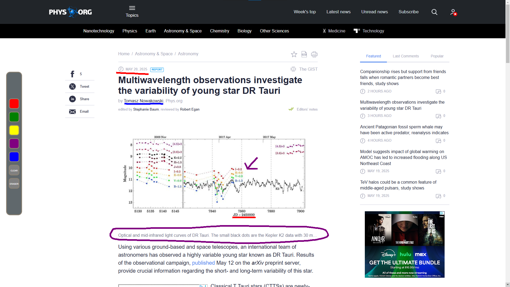

# Hello, I'm Tyler 👋

## About me 🤔
I have an infatuation for computers & technical subjects. I love to learn & work through challenges. Working under pressure is my forte. Whether working independently or as part of a team, I bring a positive and collected mindset to the table.
Dark-mode proponent. Objectively, the best color is blue.

## My Stack 📚

## What I'm working on 💻

### Shfty

##### Repo: Private

Shfty is a bot for a popular communication application, Discord. Shfty was built to effortlessly automate common tasks for servers.
• Maintains over 4,000 total users.
• Boasting over 100 users on a daily basis.
• Offers seamless shift and moderation management for roleplay-related servers.
• Allows users to set up to 400 reminders at any given time.

#### Tech Stack

### Webpage Canvas

##### Repo: [tylaur/webpage-canvas](https://github.com/tylaur/webpage-canvas)

Webpage Canvas is a Chrome Extension that allows users to annotate any webpage with ease.
• Excellent for studying purposes - no need for screenshots, come back at any time to continue where you left off.
• Transform any web page with 3 key markup functionalities - highlighers, free-draw, and erasers.

#### Teck Stack

### PinPoint

##### Repo: [tylaur/pinpoint](https://github.com/tylaur/pinpoint)

PinPoint is a real-time travel companion. Adventure on demand, wherever you land.
• Displays up to 400 local events, activities & restaurants within a 5-mile radius to users.
• Broadcasts a 24-hour weather forecast using the OpenMeteo API for satisfactory planning.
It has been built to be simple, efficient, and most of all: useful.

#### Teck Stack

     
     

